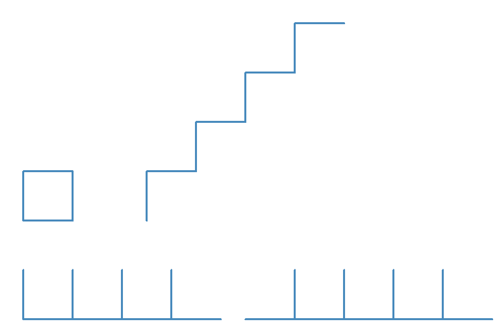
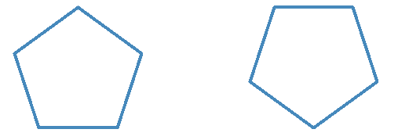

# Introducción a Python

## Semana 2
<!-- .element style="text-align:center" -->

 <!-- .element style="margin-left: auto; margin-right: auto; display: block" -->

Notes:
Pasar la [encuesta](https://forms.gle/62m79xAeYoMCi8WV8)

---

## Encuesta de Sistemas Operativos

- Tendréis que instalar Python en algún momento
- Necesito saber el sistema operativo que utilizais:
  - Encuesta:
    [https://forms.gle/ZPJbbko1yWn1Q47K8](https://forms.gle/ZPJbbko1yWn1Q47K8)

    (lo paso por el grupo)

---

### La programación son cinco cosas

1. ~~Secuencia~~ ✓
2. Condicionales
3. Repetición
4. Variables
5. Funciones


---

# Enlaces:


- Tortuga: [https://pythonandturtle.com/turtle](https://pythonandturtle.com/turtle)
- Presentación de la semana anterior:
  [https://avast-python.github.io/semana-1](https://avast-python.github.io/semana-1)
- Presentación de esta semana:
  [https://avast-python.github.io/semana-2](https://avast-python.github.io/semana-2)

En la presentación de la semana anterior tenéis los movimientos básicos de la tortuga.

**Ejemplo para acordarse: un cuadrado**

Notes:
Poner un cuadrado

---

# Repeticiones

Tiene que repetir las cosas el ordenador, no nosotros.

```python [0|1-2|5-8|5|6-8|10-11]
# Hago cosas antes
t.forward(100)

# Repito tres veces
for num_vuelta in range(3):
    # Esto es lo que se repite, ojo a la identación
    t.forward(100)
    t.left(90)

# Luego puedo hacer más cosas
t.forward(100)
```
<!-- .element: class="fragment" -->

<!-- .element style="font-size: 0.8em" -->

<ul class="fragment">
  <li>Se pueden hacer cosas antes</li>
  <li>La alineación nos dice lo que va "dentro" del `for`</li>
  <li>Después de repetir, el programa continuará como si tal cosa</li>
</ul>

---

# A pintá

[https://pythonandturtle.com/turtle](https://pythonandturtle.com/turtle)
<!-- .element class="centered" style="margin-top: -3rem;" -->


 <!-- .element class="noborder center" -->

---

# Expresiones

[https://www.pythonmorsels.com/repl/](https://www.pythonmorsels.com/repl/)

- Puedo utilizar funciones "de calculadora"
- Ojo a la precedencia de operadores: los paréntesis nunca están de más.
- No todo son números:
  - Se pueden utilizar expresiones con cadenas
  - Las cadenas y los números son cosas diferentes
  - Hay más tipos que iremos viendo

Notes:
Precedencia:
- `1+2*6`
- `10/2*5`

Ejemplos sin números:
- `"patata" + "chorizo"`
- `"patata" * 2`
- `"2" + 2`

---

# Variables

[https://pythonandturtle.com/](https://pythonandturtle.com/)

```python
mi_variable = 3
print(mi_variable)

mi_variable = 4
print(mi_variable)

# ----------------------

print(mi_variable * 5 + 2)

mi_variable = 10
mi_otra_variable = 7 * mi_variable + 100 / mi_variable
print(mi_otra_variable)

# ----------------------

mi_variable = 16
mi_variable = 16 * mi_variable
print(mi_variable)
```
<!-- .element style="font-size: 0.7em" -->

- Las variables pueden guardar cosas
- Las variables se pueden cambiar
- Se pueden utilizar variables en expresiones
- Se pueden usar una variable a la izquierda y a la derecha

---

## Vuelta al `for`


```python
lado = 10
vueltas = 10
for num_vuelta in range(vueltas):
    t.forward(num_vuelta * lado)
    t.left(90)
```
<!-- .element style="font-size: 1em" -->

- Puedo usar variables para pintar
- Puedo acceder a `num_vuelta` dentro del bucle (no hace falta que se llame `num_vuelta`)
- Empieza en cero
- ¿Qué pintará esto?


--

# A pintá

```
lados = 4
largo_lado = 100

# Aquí tu código
```
<!-- .element style="font-size: 1em" -->

- Pinta un polígono de ese número de lados y con esa longitud
- Tiene que funcionar sin tener que modificar el programa aunque cambies las variables

 <!-- .element class="noborder center" -->

**Pista**: En un polígono regular todos los ángulos internos son iguales
y la suma es igual a 180° × (lados – 2).


**Extra**: Haz que en la base vaya un vértice, no una arista

---

# A pintá

 <!-- .element class="noborder center" -->

 <!-- .element class="noborder center" -->

---

# A almorzá

- Presentación: [https://avast-python.github.io/semana-2/](https://avast-python.github.io/semana-2/)
- Soluciones: [https://github1s.com/AVAST-Python/semana-2](https://github1s.com/AVAST-Python/semana-2)


