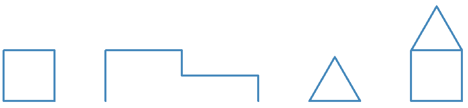
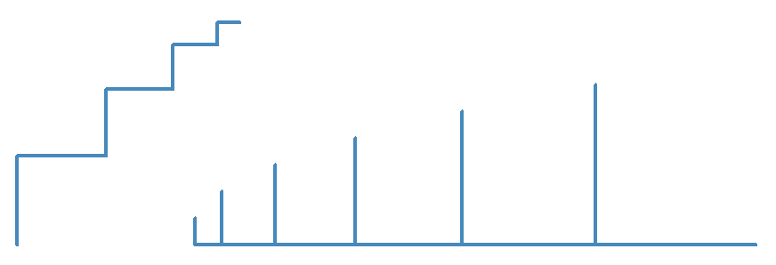

# Introducción a Python

## Semana 3
<!-- .element style="text-align:center" -->

 <!-- .element style="margin-left: auto; margin-right: auto; display: block" -->

---

### La programación son cinco cosas

1. ~~Secuencia~~ ✓
2. Condicionales <-
3. Repetición <-
4. Variables <-
5. Funciones

---

## Vuelta al `for`


```python
lado = 10
vueltas = 10
for num_vuelta in range(vueltas):
    t.forward(num_vuelta * lado)
    t.left(90)
```
<!-- .element style="font-size: 1em" -->

- Puedo usar variables para pintar
- Puedo acceder a `num_vuelta` dentro del bucle (no hace falta que se llame `num_vuelta`)
- Empieza en cero
- ¿Qué pintará esto?


--

# Ejercicio 1

```
lados = 4
largo_lado = 100

# Aquí tu código
```
<!-- .element style="font-size: 1em" -->

- Pinta un polígono de ese número de lados y con esa longitud
- Tiene que funcionar sin tener que modificar el programa aunque cambies las variables

 <!-- .element class="noborder center" -->

**Pista**: En un polígono regular todos los ángulos internos son iguales
y la suma es igual a 180° × (lados – 2).


**Extra**: Haz que en la base vaya un vértice, no una arista

---

# Ejercicio 2

 <!-- .element class="noborder center" -->

#### Extra: <!-- .element style="text-align:center" -->

 <!-- .element class="noborder center" -->


---

# Bucles múltiples

```python
for vuelta_exterior in range(5):

    t.pendown()

    for vuelta_interior in range(4):
        t.forward(100)
        t.left(90)

    t.penup()
    t.left(30)
```

- Se pueden usar bucles dentro de bucles
- Dentro de un bucle, lo que hay una secuencia de instrucciones
- Esa secuencia puede, a su vez, ser un bucle

---

# Ejercicio 3

 <!-- .element class="noborder center" -->

**Extra**: ¿Puedes hacerlos utilizando variables para el largo de la línea, distancia entre líneas, lado del cuadrado largo...?

---

# Booleanos

- Es otro tipo de datos fundamental (además de "números" y cadenas )
- Dos valores: `True` / `False` (o verdad / mentira, cero/uno)
- Operadores para conseguir booleanos:
  - `True` y `False`
  - Igual: `==` ¡¡¡OJO!!! ¡¡NO ES UN SOLO `=`!!
  - Distinto: `!=`
  - Mayor, mayor o igual: `>`, `>=`
  - Menor, menor o igual: `<` `<=`
- Los usaremos para comparar números y cadenas, pero ojo con comparar cadenas

<br>

- **OJO**: Cuidado cuando comparéis números con decimales: ¿`0.1 + 0.2 == 0.3`?
- **OJO**: Se pueden encadenar, pero no os lo recomiendo: `1 < 2 < 3`
- Los comparadores en Python son más complejos, pero ya hablaremos más de ellos

---

IF, else

---

https://www.youtube.com/watch?v=KtYgG6VIrFg&ab_channel=SanjinDedic
https://www.youtube.com/watch?v=3psKwVWuGkI&ab_channel=ITELSPACE

Operador %
Rellenar con la tortuga: begin_fill(), end_fill()
Ejercicios tortuga con condicional

Cuadrados rellenos alternos
Tablero ajedrez


---


DESDE AQUI, MUY AVANZADO: HACER PARA CUANDO VOLVAMOS A RETOMAR BUCLES Y CONDICIONALES

---

# Operaciones con booleanos

- Tres operaciones: `NOT`, `AND`, `OR`:


<table>
<tr><th>NOT</th><th>AND</th><th>OR</th></tr>
<tr>
<td>

|a| `not(a)` |
|--|--|
| True | False |
| False | True |

</td><td>

|a|b|`a and b`|
|--|--|--|
| True | True | True |
| True | False | False |
| False | True | False |
| False | False | False |
</td><td>

|a|b|`a or b`|
|--|--|--|
| True | True | True |
| True | False | True |
| False | True | True |
| False | False | False |

</td></tr>
</table>

---

# Ejercicio con booleanos

```python
he_robado = ...
me_han_pillado = ...
he_sido_acusado_injustamente = ...
he_sobornado_al_juez = ...
tengo_millones = 0.001
```
<!-- .element style="font-size: 1em" -->
Escribe expresiones booleanas para lo siguiente. `True` es que vas a la carcel:
- Si has robado y te han pillado, vas a la carcel.
- Si has robado, o no has robado pero  has sido acusado injustamente, vas a la carcel
- Si has robado y te han pillado vas a la carcel, excepto si has sobornado al juez
- Si tienes más de 100 millones, no vas a la carcel aunque hayas robado y te hayan pillado
- Si has sobornado al juez y te han pillado, vas a la carcel.

---

IF


VER OPERADOR INPUT

---

EJERCICIO IF
